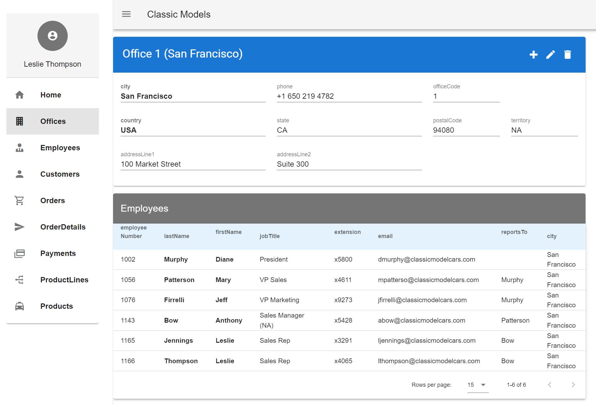
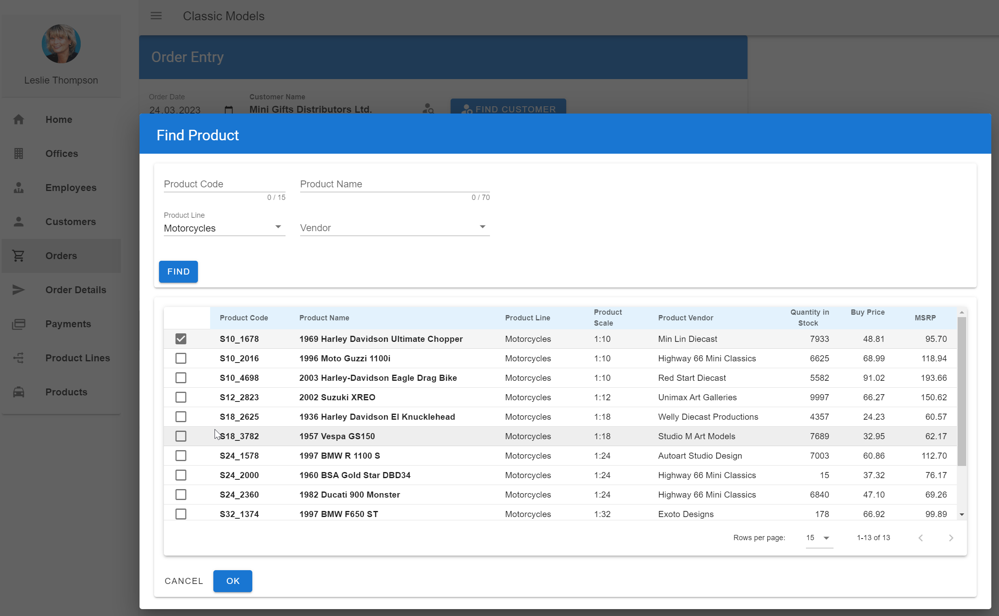
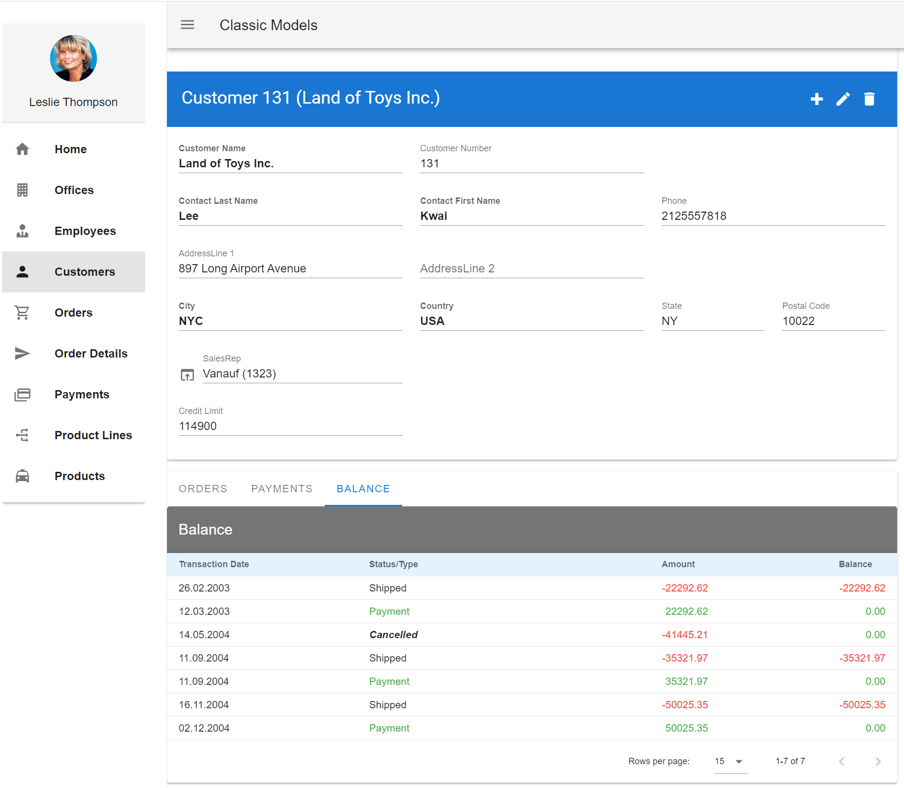

# classic_models_frontend_vue

## What it is
This is a simple frontend for the [MySQL Sample Database](https://www.mysqltutorial.org/mysql-sample-database.aspx).

It depends on my Webservice backend "classic_models_backend_spring".

### Tooling
"classic_models_frontend_vue" is a SPA (Single page application), using vue.js.

This frontend uses:
* [Vue.js 2](https://vuejs.org/)
* [Vuetify](https://vuetifyjs.com/en/), a Vue component library 
* [Vuerouter](https://router.vuejs.org/)
* [node.js and npm](https://docs.npmjs.com/downloading-and-installing-node-js-and-npm)
* Javascript (as programming language)
  
## How to install
* "classic_models_frontend_vue" depends on its backend "classic_models_backend_spring" and MySQL, so you should install and run them first.
* [Download and install node.js and npm](https://docs.npmjs.com/downloading-and-installing-node-js-and-npm)
* [Install vue 2](https://v2.vuejs.org/v2/guide/installation.html) with "npm install vue"
* You may find the [Vue CLI](https://cli.vuejs.org/) useful.
* Clone this repository ("classic_models_frontend_vue")
* Open a terminal
* Switch into the project directory
* Run "npm install"

## How to run
* Run the backend "classic_models_backend_spring" first. This will use Port 8080.
* Run "classic_models_frontend_vue". This will use Port 8081, and expect the backend at Port 8080.
* For development: run "npm run serve"
* For production: run "npm run build"

## News
* First version of Order Entry

## Todos
* Insert, Update, Delete is only implemented for Offices.
* Recursive Navigation in Employees doesn't refresh details correctly.
* Clean up code
* Fix browser console errors ("null" errors for data, caused by event timing)

## Pictures

